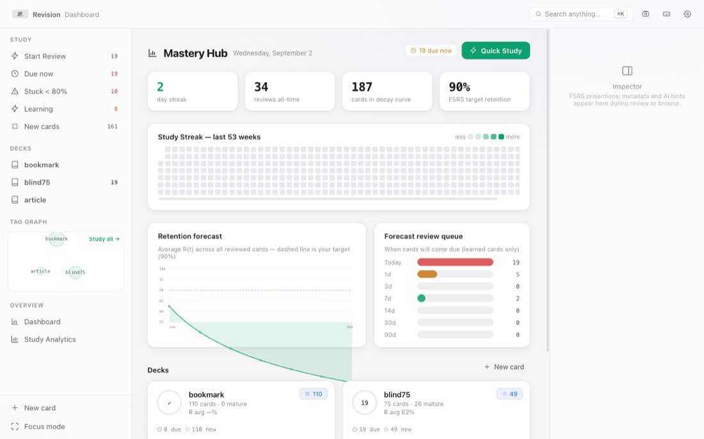
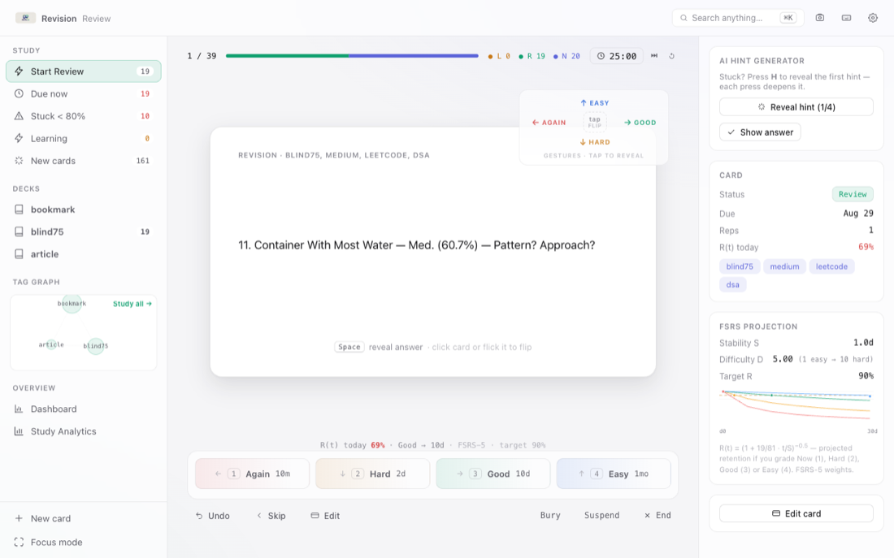
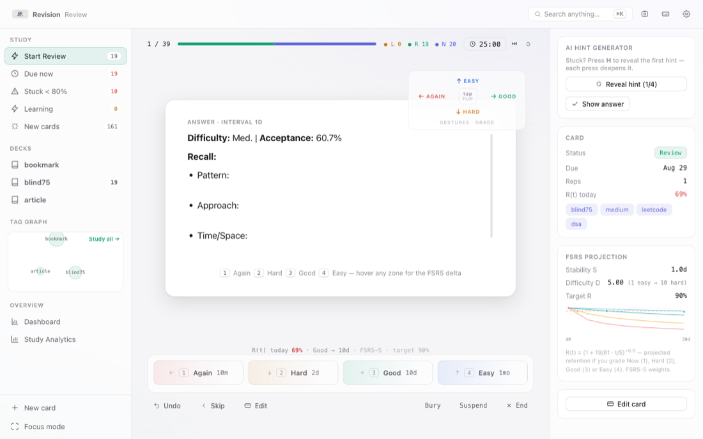
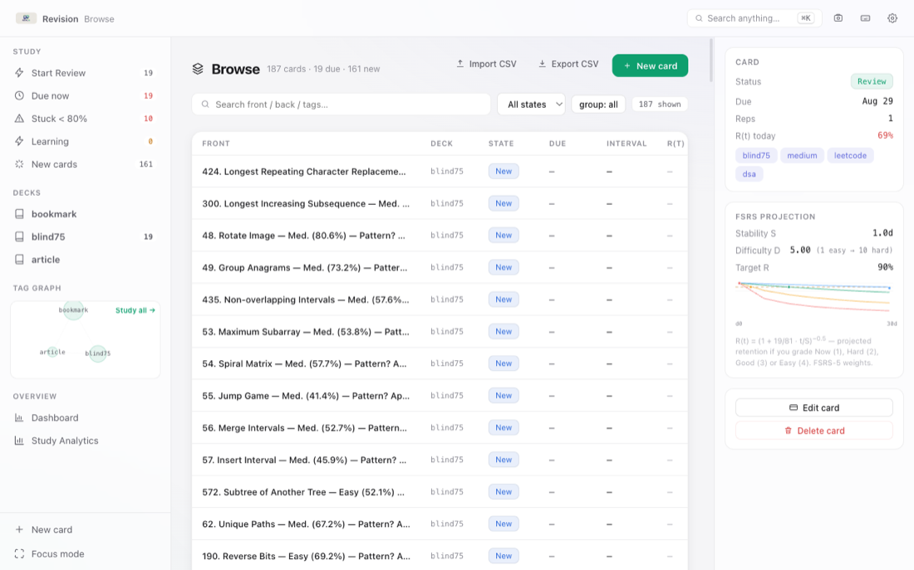
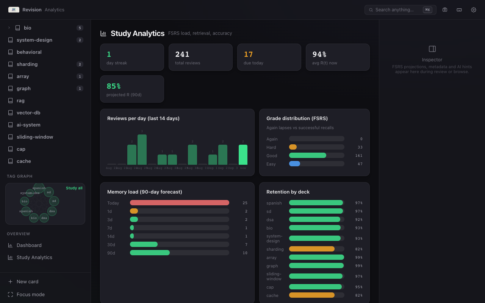

# Revision — Active Recall (Tauri + SQLite)

Local-first desktop app for principal-level interview prep. **FSRS-5 spaced repetition** for **DSA / System Design Concepts / System Design Use Cases / AI Concepts / AI Use Cases / Behavioral** — a keyboard-first, glassmorphic macOS app with drag & air gestures.

> Works fully offline. Single SQLite file `revision.db` (Tauri) or `localStorage` (browser preview). No cloud, no account.

---

## Download & Install

Latest: **v0.3.1** — releases are built automatically from `v*` tags (see [releases](https://github.com/xpressabhi/revision/releases)). See [CHANGELOG.md](CHANGELOG.md) for what's new per version.

| Platform | Installer | Size |
|---|---|---|
| macOS Apple Silicon (M1/M2/M3/M4) | [Revision_0.3.1_aarch64.dmg](https://github.com/xpressabhi/revision/releases/latest/download/Revision_0.3.1_aarch64.dmg) | 21.5 MB |
| macOS Intel | [Revision_0.3.1_x64.dmg](https://github.com/xpressabhi/revision/releases/latest/download/Revision_0.3.1_x64.dmg) | 21.5 MB |
| Windows | [Revision_0.3.1_x64-setup.exe](https://github.com/xpressabhi/revision/releases/latest/download/Revision_0.3.1_x64-setup.exe) · [.msi](https://github.com/xpressabhi/revision/releases/latest/download/Revision_0.3.1_x64_en-US.msi) | 16.5 MB · 19.9 MB |

Small app — every installer is under 25 MB.

macOS: open the .dmg and drag Revision to Applications (first launch: right-click → Open if Gatekeeper complains — the app is signed with ad-hoc signatures only). Windows: run the installer.

## Features

- **FSRS-5 scheduler**: live interval predictions on the grading bar, desired-retention control (80–95%), per-grade projections in the inspector
- **Review by gestures**: grab the card to flip or grade it (← Again · → Good · ↑ Easy · ↓ Hard) — plus optional **air gestures** (pinch to flip, air-swipes to grade) via your webcam, processed fully on-device
- **Keyboard-first everything**: Space reveal, 1–4 grade, G cloze reveal, H hints, ⇧G undo, ⌃→ skip, ⌘K command bar
- **Cloze deletions + LaTeX**: `{{c1::answer}}` with progressive reveal, KaTeX rendering
- **Dashboards & analytics**: 53-week streak heatmap, FSRS retention forecast, grade distribution, memory-load charts
- **Quick capture (⌘⇧K)** + on-device **AI card generator** (no API key)
- **Tray & widgets**: `Due X • New Y` menu-bar tray, in-app widget window, macOS WidgetKit desktop widget, launch-at-login
- Single-deck data model with tag trees; Browse with search/filters; CSV import/export; Blind 75 seed & demo content

## Screenshots

| | |
|---|---|
| **Dashboard** — due today, streak heatmap thumbnails, smart study queues | **Review** — front of card with the gesture map (← Again · → Good · ↑ Easy · ↓ Hard) |
|  |  |
| **Review (shown)** — answer side with the FSRS prediction grading bar | **Browse** — search, filters, inline edit |
|  |  |
| **Analytics** — retention forecast, heatmap, grade distribution | |
|  | |

## Docs

| Doc | What's inside |
|---|---|
| [User guide](docs/USER_GUIDE.md) | Keyboard map, gestures (drag + air), CSV format, DB location & backup, tray/widgets/autostart, updates |
| [Development](docs/DEVELOPMENT.md) | Stack, run/build commands, project layout, release process |
| [Changelog](CHANGELOG.md) | Release history |

## License

MIT — personal use.