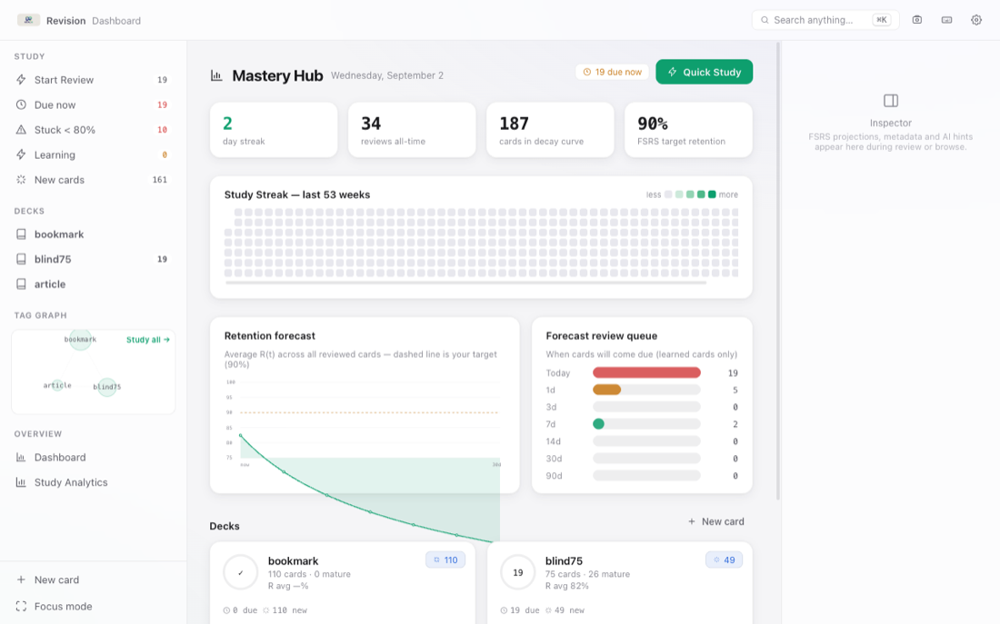
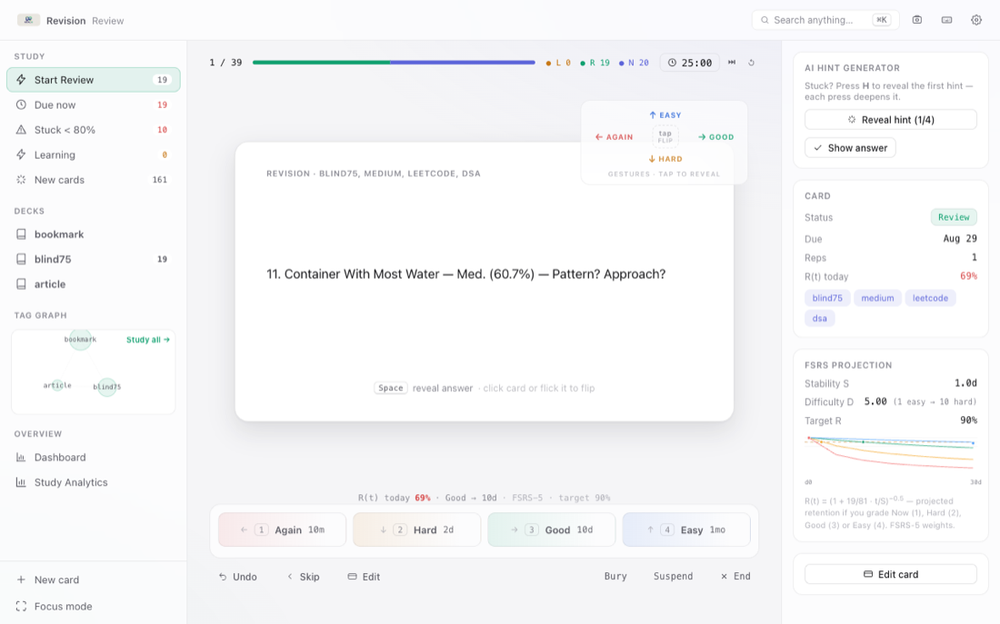
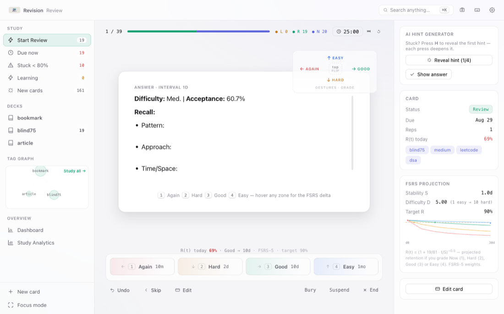
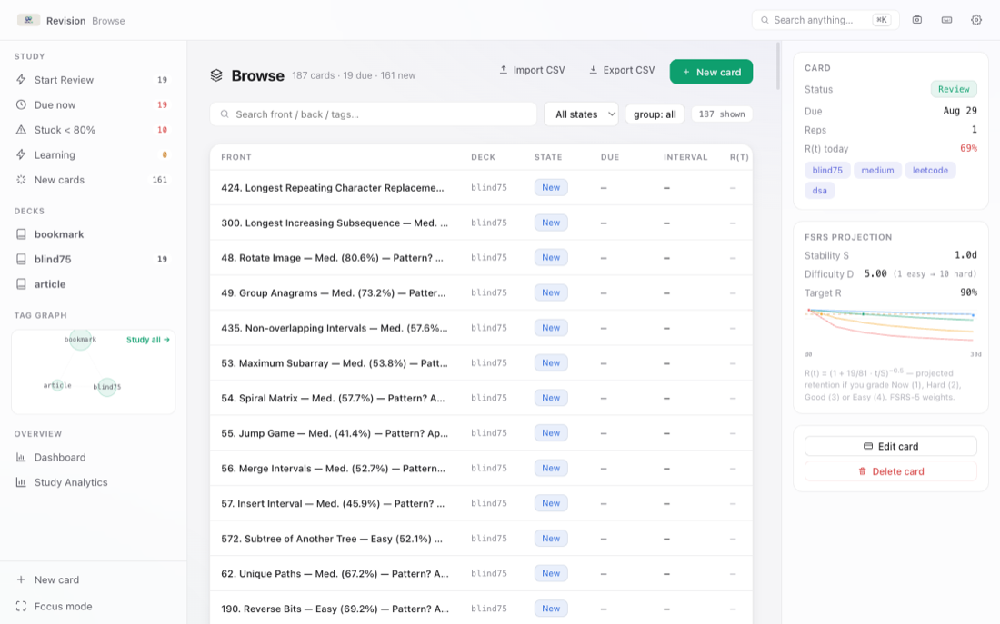
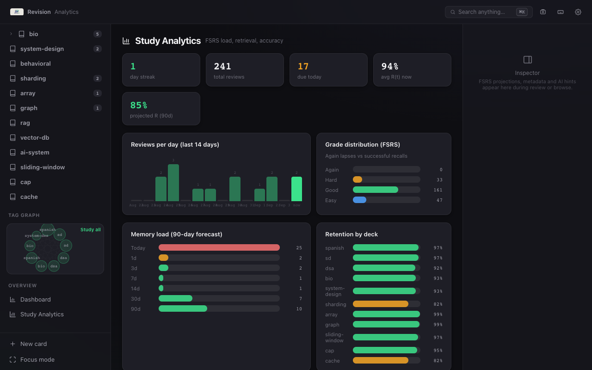

# Revision — Active Recall (Desktop + Web)

Local-first study app for principal-level interview prep. **FSRS-5 spaced repetition** for **DSA / System Design Concepts / System Design Use Cases / AI Concepts / AI Use Cases / Behavioral** — a keyboard-first, glassmorphic app for macOS, Windows, Linux and the browser, with drag gestures.

> Core features work fully offline. Desktop keeps a single SQLite file `revision.db`; the web app keeps everything in the browser (IndexedDB). No account, no telemetry, no network — and you can **sync both through one JSON file** you control.

---

## Web app

**Live: [dailyrevision.vercel.app](https://dailyrevision.vercel.app)** — the same React app, hosted as a static site. Cards live in **IndexedDB** in your browser: no server, no database, no account. Open it, study, and sync back to the desktop app whenever you want:

[Watch the walkthrough](docs/media/walkthrough.mp4) — first-run setup guide, review loop, adding a card and a live sync merge (~30s, no audio).

1. In the desktop app: **Settings → Data → Sync → Attach sync file…** (e.g. `~/Documents/revision-sync.json`).
2. In the web app: **Settings → Data → Sync → Attach sync file…** and pick the same file (Chromium; Safari/Firefox fall back to export/import buttons).
3. Hit **Sync now** on either side. Cards match by a stable id, the newest edit wins, review history is merged and deletions propagate.

Deploying the web app is one Vercel project pointing at this repo — see [docs/DEVELOPMENT.md](docs/DEVELOPMENT.md#web-app--vercel).

---

## Download & Install

Latest: **v0.8.0** — releases are built automatically from `v*` tags (see [releases](https://github.com/xpressabhi/revision/releases)). See [CHANGELOG.md](CHANGELOG.md) for what's new per version.

| Platform | Download | Size |
|---|---|---|
| macOS Apple Silicon (M-series) | [revision-0.8.0-macos-arm64.dmg](https://github.com/xpressabhi/revision/releases/latest/download/revision-0.8.0-macos-arm64.dmg) | 6.3 MB |
| macOS Intel | [revision-0.8.0-macos-x86_64.dmg](https://github.com/xpressabhi/revision/releases/latest/download/revision-0.8.0-macos-x86_64.dmg) | 6.6 MB |
| Windows (x64) | [revision-0.8.0-win.zip](https://github.com/xpressabhi/revision/releases/latest/download/revision-0.8.0-win.zip) | 5.5 MB |
| Linux (x86_64) | [revision-0.8.0-linux-x86_64.tar.gz](https://github.com/xpressabhi/revision/releases/latest/download/revision-0.8.0-linux-x86_64.tar.gz) | 7.0 MB |

Tiny app — every download is under 8 MB (the old 41 MB MediaPipe bundle is long gone).

**macOS 15+** (Sequoia or newer): open the .dmg and drag Revision to Applications (first launch: right-click → Open if Gatekeeper complains — the app is signed with ad-hoc signatures only).
**Windows 10/11**: unzip and run `revision.exe` (needs the WebView2 runtime — preinstalled on Windows 11).
**Linux** (glibc 2.35+, `libwebkit2gtk-4.1-0`): untar and run `./revision` from the extracted folder.

## Features

- **FSRS-5 scheduler**: live interval predictions on the grading bar, desired-retention control (80–95%), daily new/review limits, per-grade projections in the inspector
- **Review by gestures**: grab the card to flip or grade it (← Again · → Good · ↑ Easy · ↓ Hard), or use the keyboard
- **Session summary**: cards, accuracy, lapses and time on completion, with one-click "review lapses"
- **Leech detection**: cards that lapse 6+ times surface as a "Leeches" queue
- **Card history**: every grade per card is listed in the inspector
- **Backups**: export/import full JSON state (scheduling included) plus automatic pre-destructive snapshots
- **Web app + file sync**: run in the browser (IndexedDB, no install) and sync with the desktop app through one JSON file — manual button, newest edit wins, reviews merged
- **Keyboard-first everything**: Space reveal, 1–4 grade, G cloze reveal, ⇧G undo, ⌃→ skip, ⌘K command bar, global ⌥⇧K quick capture (desktop)
- **Cloze deletions + LaTeX + images**: `{{c1::answer}}` progressive reveal, KaTeX rendering, paste images into cards
- **Dashboards & analytics**: 53-week streak heatmap, retention forecast, grade mix, 30-day pass rate, exam-date planner
- **Tray**: `Due X • New Y` menu-bar tray with Start Review, launch-at-login
- **Imports**: CSV, Chrome bookmarks (HTML/JSON), paste text, and Anki `.apkg` decks
- Single-deck data model with tag trees; Browse with search, filters and bulk actions

## Screenshots

| | |
|---|---|
| **Dashboard** — due today, streak heatmap thumbnails, smart study queues | **Review** — front of card with the gesture map (← Again · → Good · ↑ Easy · ↓ Hard) |
|  |  |
| **Review (shown)** — answer side with the FSRS prediction grading bar | **Browse** — search, filters, inline edit |
|  |  |
| **Analytics** — retention forecast, heatmap, grade distribution | |
|  | |

## Docs

| Doc | What's inside |
|---|---|
| [User guide](docs/USER_GUIDE.md) | Keyboard map, gestures, daily limits, backups, imports (CSV/bookmarks/Anki), DB location, tray/autostart, updates |
| [Development](docs/DEVELOPMENT.md) | Stack, run/build commands, project layout, release process |
| [Changelog](CHANGELOG.md) | Release history |

## License

MIT — personal use.